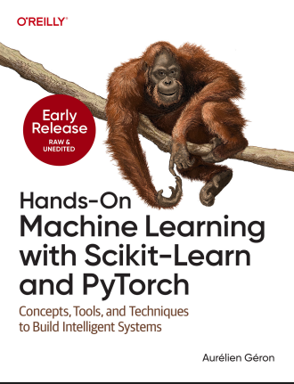

## Hands on Machine Learning with Scikit-Learn and Pytorch

## About

This repository is based on the book \*Hands-On Machine Learning with Scikit-Learn and Pytorch by Aurélien Géron.  
It focuses on learning and implementing core machine learning concepts using Scikit-Learn and PyTorch through practical, hands-on experiments.

The repository covers key topics such as data preprocessing, model building, training, and evaluation, with an emphasis on understanding how machine learning models work in real-world scenarios.
